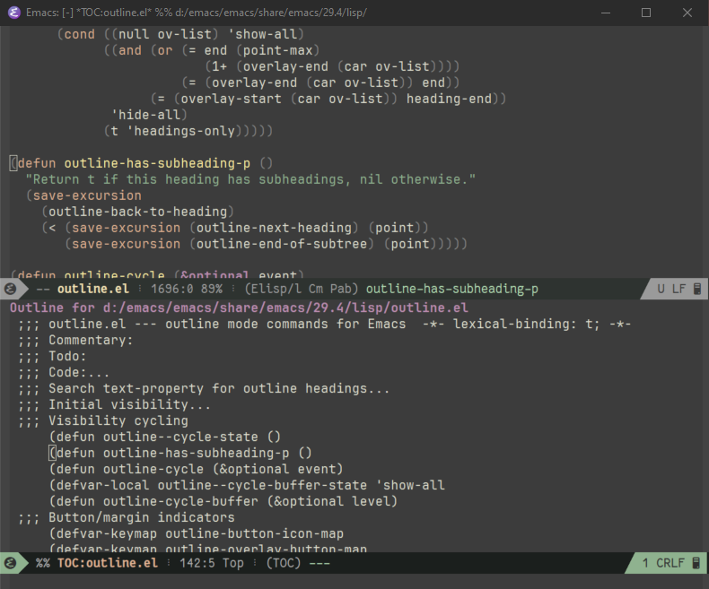

# outline-toc

outline-toc will create a new buffer with all the outline headings from the current file. You can use this to quickly jump to headings in the orignal file.

To create the outline table of contents (TOC) buffer for the current file make sure that `outline-regexp` and `outline-level` are valid (most modes should have sane default), then issue the command:

``` shell
M-x outline-toc-show
```

The TOC buffer displays the headings in `outline-mode` and can be easily navigated with outline commands.

- <kbd>p</kbd> `previous-line`
- <kbd>n</kbd> `next-line`
- <kbd>TAB</kbd> `outline-toc-toggle-children`
- <kbd>h</kbd> `outline-hide-sublevels`
- <kbd>a</kbd> `outline-show-all`
- <kbd>f</kbd> `outline-foward-same-level`
- <kbd>b</kbd> `outline-backward-same-level`
- <kbd>u</kbd> `outline-up-heading`

From the TOC buffer you can show or jump to the corresponding point in the original buffer

- <kbd>o</kbd> `outline-toc-goto-heading-other-window`
- <kbd>C</kbd><kbd>o</kbd> `outline-toc-goto-heading`

You can also enable follow mode to automatically display the corresponding source location

- <kbd>C</kbd><kbd>f</kbd> <kbd>C</kbd><kbd>f</kbd> `outline-toc-toggle-follow-mode`

## Example ##



## Extras ##

`helm-outline.el` contains two simple helm commands to jump to file headings using helm

- `helm-outline`
- `helm-outline-and-imenu`

